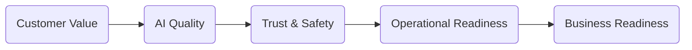
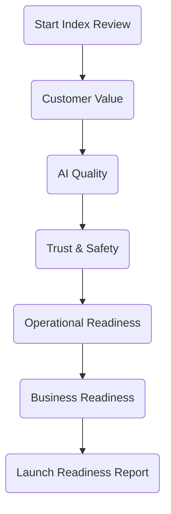
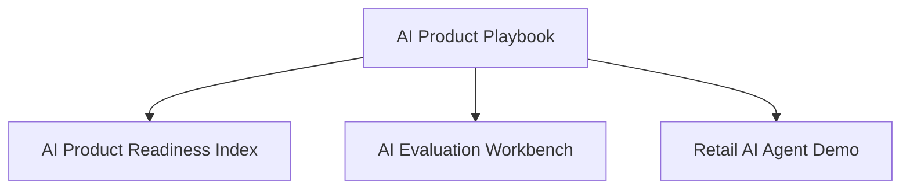

# 🚀 AI Product Readiness Index

> **A practical launch review tool that helps AI Product Managers determine whether an AI product is ready for Beta or Production.**

Building an AI feature is only half the challenge.

The harder question is:

> **"Is this AI product actually ready to launch?"**

The **AI Product Readiness Index** provides a structured, repeatable launch review that evaluates AI products across **five critical launch gates**, identifies launch blockers, and generates actionable recommendations before release.

Unlike traditional scorecards, the goal is **not simply to assign a score**.

The goal is to help product teams make better launch decisions.

---

# ✨ Why This Project Exists

AI launches are often reviewed using:

* spreadsheets
* scattered documentation
* subjective discussions
* inconsistent quality standards

As AI products become more complex, launch readiness requires evaluating much more than model accuracy.

Teams must consider:

* customer value
* AI quality
* trust & safety
* operational readiness
* business readiness

This project brings those dimensions together into a single guided launch review.

---

# 🎯 Who This Is For

This project is designed for:

* AI Product Managers
* Product Leaders
* Engineering Managers
* Applied AI Teams
* Technical Program Managers
* AI Strategy & Innovation Teams

---

# 🧭 The Five Launch Gates

Every launch review evaluates readiness across five dimensions.



| Gate                    | Question                                      |
| ----------------------- | --------------------------------------------- |
| 🎯 Customer Value       | Are we solving a meaningful customer problem? |
| 🤖 AI Quality           | Is the AI consistently good enough?           |
| 🛡 Trust & Safety       | Can customers trust the system?               |
| ⚙ Operational Readiness | Can the organization support the feature?     |
| 📈 Business Readiness   | Does the product create measurable value?     |

---

# 🖥 Product Workflow



The application guides users through approximately **20 launch readiness questions**.

Each answer contributes to:

* Readiness Index
* Gate Scores
* Launch Blockers
* Top Risks
* Recommended Next Actions
* Launch Recommendation

---

# 📊 Sample Output

The final report provides:

* ✅ Readiness Index
* ✅ Launch Recommendation
* ✅ Confidence Level
* ✅ Gate-by-Gate Scores
* ✅ Launch Blockers
* ✅ Top Risks
* ✅ Recommended Next Actions

Example recommendation:

```text
Launch Decision

🟡 READY FOR BETA

Confidence

HIGH

Top Risks

• Human evaluation incomplete

• Rollback strategy missing

Recommended Actions

• Complete Human Evaluation

• Create Rollback Plan
```

---

# 📸 Screenshots

## Landing Page

> *(Add screenshot here)*

```
screenshots/landing-page.png
```

---

## Launch Readiness Report

> *(Add screenshot here)*

```
screenshots/results-page.png
```

---

# 🏗 Repository Structure

```text
ai-product-readiness-index/

├── app/
│   ├── app.py
│   ├── utils/
│   └── assets/
│
├── data/
│   ├── questions.json
│   ├── scoring_rules.json
│   └── sample_assessment.json
│
├── docs/
│   ├── PRD.md
│   ├── UX_Flow.md
│   ├── Architecture.md
│   └── Scoring_Model.md
│
├── screenshots/
│
├── README.md
└── requirements.txt
```

---

# ⚡ Running Locally

```bash
python3 -m venv .venv

source .venv/bin/activate

pip install -r requirements.txt

streamlit run app/app.py
```

---

# 🧠 Design Principles

The application is built around a few simple principles.

* Customer problems before model capabilities
* Product judgment over model metrics
* Transparent scoring
* Responsible AI by design
* Launch decisions supported by evidence
* Simplicity over complexity

---

# 🗺 Roadmap

## Version 1

* ✅ Guided Launch Review
* ✅ Five Launch Gates
* ✅ Readiness Index
* ✅ Launch Blockers
* ✅ Recommendation Engine
* ✅ Streamlit MVP

---

## Version 1.1

* PDF Export
* Executive Launch Memo
* Better Visualizations
* Historical Assessments

---

## Version 2

* Upload PRD
* Auto-populate Review
* AI-generated Recommendations
* AI-generated Executive Memo
* Organization Benchmarks

---

# 🌎 AI Product Ecosystem

This project is part of a broader AI Product Management portfolio.



| Repository                                                                        | Purpose                                                             |
| --------------------------------------------------------------------------------- | ------------------------------------------------------------------- |
| **[AI Product Playbook](https://github.com/sadasib/ai-product-playbook)**         | Frameworks, templates, and operating models for AI Product Managers |
| **[AI Evaluation Workbench](https://github.com/sadasib/ai-evaluation-workbench)** | Evaluate AI quality using structured scoring and synthetic datasets |
| **[Retail AI Agent Demo](https://github.com/sadasib/retail-ai-agent-demo)**       | Demonstrates the framework in a realistic retail AI workflow        |

---

# 🤝 Contributing

Ideas, improvements, and constructive feedback are always welcome.

If you've used the AI Product Readiness Index in your own work, I'd love to hear how it helped and what could make it even better.

---

# ⚠ Disclaimer

This repository is a personal portfolio project created for learning and knowledge sharing.

All examples, datasets, and scenarios use synthetic data and publicly available concepts.

Nothing in this repository contains confidential information or represents the views of my employer.
