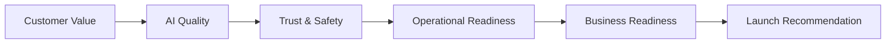
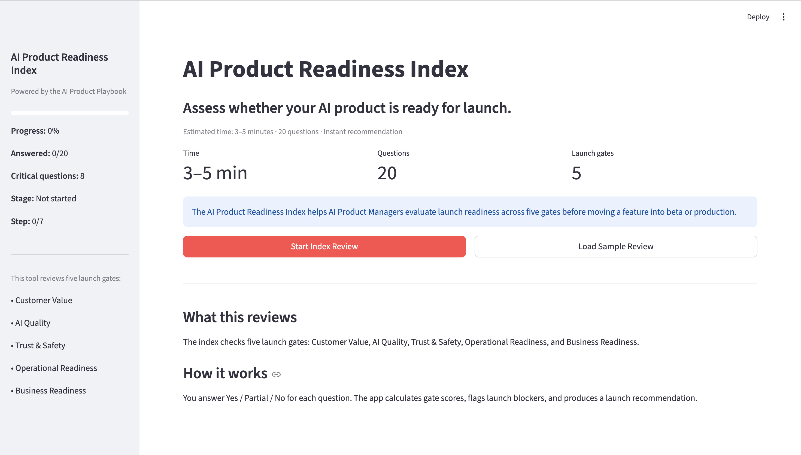
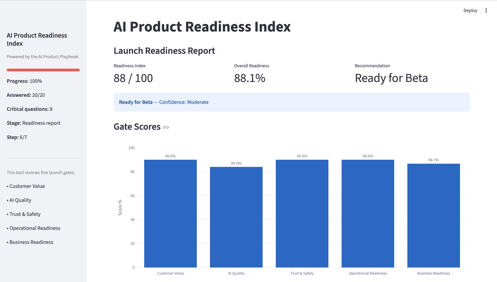

# 🚀 AI Product Readiness Index

> **A practical launch review tool for AI Product Managers to evaluate whether an AI product is ready for Beta or Production.**

Building an AI feature is relatively easy.

Building confidence to launch it is much harder.

The **AI Product Readiness Index** helps product teams evaluate launch readiness using a structured review across **Customer Value, AI Quality, Trust & Safety, Operational Readiness, and Business Readiness**.

Rather than producing only a score, it identifies **launch blockers**, **top risks**, **recommended next actions**, and a clear **launch recommendation**.

---

# Why I Built This

Most AI launch reviews today are spread across:

* PRDs
* Evaluation documents
* Risk registers
* Launch checklists
* Executive reviews
* Tribal knowledge

As a result, launch decisions often become subjective and inconsistent.

I wanted a lightweight product that could answer one simple question:

> **"Is this AI product ready to launch?"**

---

# Product Workflow


```mermaid
flowchart LR

A[Customer Value]

-->B[AI Quality]

-->C[Trust & Safety]

-->D[Operational Readiness]

-->E[Business Readiness]

-->F[Launch Recommendation]
```

Users complete a guided review consisting of **20 questions** across five launch gates.

The application then generates:

* 📊 Readiness Index
* 🚦 Launch Recommendation
* ⚠ Launch Blockers
* 🔍 Top Risks
* ✅ Recommended Next Actions

---

# Screenshots

## Landing Page



---

## Launch Readiness Report



---

# What Makes This Different?

Unlike traditional scorecards, the AI Product Readiness Index combines:

* Structured product thinking
* AI evaluation principles
* Responsible AI practices
* Operational readiness
* Executive launch decision support

The objective isn't simply to calculate a score.

The objective is to improve launch decisions.

---

# Launch Gates

| Gate                    | Key Question                                        |
| ----------------------- | --------------------------------------------------- |
| 🎯 Customer Value       | Are we solving a meaningful customer problem?       |
| 🤖 AI Quality           | Is the AI consistently good enough?                 |
| 🛡 Trust & Safety       | Can customers trust the system?                     |
| ⚙ Operational Readiness | Can the organization monitor, support, and recover? |
| 📈 Business Readiness   | Does the product create measurable business value?  |

---

# Example Output

The application generates a launch review containing:

* Readiness Index
* Overall Readiness %
* Launch Recommendation
* Confidence Level
* Gate Scores
* Launch Blockers
* Top Risks
* Recommended Next Actions

Example:

```text
AI Product Readiness Index

88 / 100

Recommendation

READY FOR BETA

Confidence

Moderate

Launch Blockers

• Escalation behavior not fully validated

Top Risks

• Human evaluation incomplete
• Rollback strategy missing

Recommended Next Actions

• Complete Human Evaluation
• Validate Escalation Workflow
```

---

# Repository Structure

```text
ai-product-readiness-index/

├── app/
│   ├── app.py
│   └── utils/
│
├── data/
│   ├── questions.json
│   ├── scoring_rules.json
│   └── sample_assessment.json
│
├── docs/
│   ├── PRD.md
│   ├── UX_Flow.md
│   ├── Scoring_Model.md
│   └── Architecture.md
│
├── screenshots/
│
├── README.md
└── requirements.txt
```

---

# Running Locally

```bash
python3 -m venv .venv

source .venv/bin/activate

pip install -r requirements.txt

streamlit run app/app.py
```

---

# Design Principles

The AI Product Readiness Index is built around six principles:

* Customer problems before model capabilities.
* Product judgment over model metrics.
* Transparent scoring.
* Responsible AI by design.
* Launch decisions supported by evidence.
* Simplicity over complexity.

---

# Roadmap

## Version 1

* ✅ Guided Launch Review
* ✅ Five Launch Gates
* ✅ Readiness Index
* ✅ Launch Blockers
* ✅ Recommendation Engine
* ✅ Interactive Streamlit Application

---

## Version 1.1

* Save & Load Assessments
* Executive Launch Memo Export
* Richer Visualizations
* Assessment History

---

## Version 2

* Upload PRD
* Auto-populate Review
* AI-generated Executive Decision Memo
* AI-generated Recommendations
* Multiple Product Domains
* Benchmarking Across Assessments

---

# AI Product Builder Portfolio

The AI Product Readiness Index is part of a broader AI Product Management portfolio.

| Repository                                                                            | Purpose                                                             |
| ------------------------------------------------------------------------------------- | ------------------------------------------------------------------- |
| **[AI Product Playbook](https://github.com/sadasib/ai-product-playbook)**             | Frameworks, templates, and operating models for AI Product Managers |
| **[AI Evaluation Workbench](https://github.com/sadasib/ai-evaluation-workbench)**     | Structured evaluation toolkit for measuring AI quality              |
| **[Retail AI Agent Demo](https://github.com/sadasib/retail-ai-agent-synthetic-demo)** | Demonstrates the framework using a synthetic retail AI workflow     |

---

# Contributing

Suggestions, improvements, and constructive feedback are always welcome.

If this project helps your team improve AI launch decisions, I'd love to hear how you're using it.

---

# Disclaimer

This repository is a personal portfolio project created for learning and knowledge sharing.

All examples use synthetic data and publicly available concepts.

Nothing in this repository contains confidential information or represents the views of my employer.
